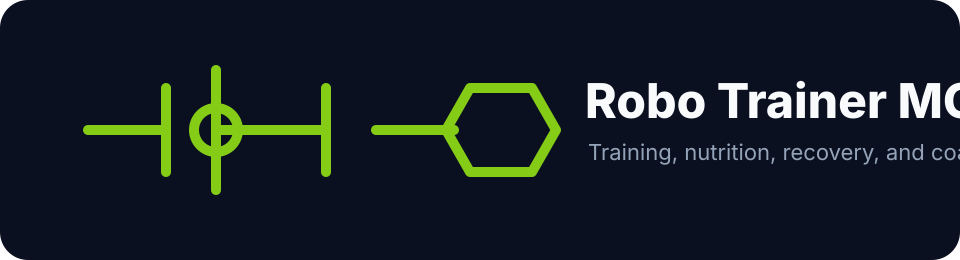
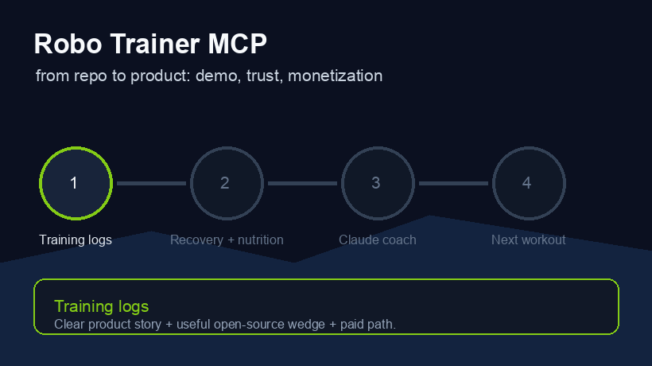

# robo-trainer-mcp




MCP server that turns Claude into a full-stack personal trainer. Nutrition coaching, strength programming, powerlifting analytics, strongman tracking, recovery monitoring, and mental performance: all from a single local server, nothing leaving your machine.



---

## The problem it solves

Every fitness app works in isolation. Your food tracker knows your macros. Your training log knows your lifts. Your sleep tracker knows your HRV. None of them talk to each other, and none of them can tell you *why* you're stuck.

robo-trainer-mcp connects everything. Claude can pull training volume, sleep trends, nutrition, and mood at once: then reason across them like a real coach.

---

## Demos

### Diagnosing a plateau

```
You: "My squat hasn't moved in 5 weeks and I feel exhausted. What's wrong?"

Claude pulls:
  training_get_volume_trend("squat", weeks=6)
  recovery_get_sleep_trend(days=42)
  nutrition_get_weekly_macros()
  mental_get_mood_trend(days=42)

  Squat volume: 12,400 → 15,300 kg  +23%  (no deload)
  Sleep:        8.1h → 6.3h          ▼ 22%
  Calories:     2,150 kcal vs 2,600 goal   deficit −450/day
  Protein:      168 g vs 210 g goal        gap −42 g/day

  Diagnosis: Classic overreaching. Four recovery systems degraded
  simultaneously. Deload this week, calories to maintenance,
  8+ hours sleep. Expect a squat PR within 3 weeks.
```

### Powerlifting meet prep

```
You: "I squat 200, bench 130, deadlift 240 at 93 kg bodyweight."

  Wilks 2020:  358.4  (Advanced)
  DOTS:        347.1  (Advanced)

  Weakest lift: Bench: 3.2% below elite average proportion.
  Recommendation: hypertrophy + technique block on bench.

  Attempt suggestions:
    Squat    180 / 195 / 207.5
    Bench    117.5 / 127.5 / 135
    Dead     215 / 235 / 250
```

### Readiness check

```
You: "I slept 6 hours, quality 5/10, soreness 7/10, stress 7/10."

  recovery_calculate_readiness(6.0, 5, 7, 7)

  Readiness: 41 / 100
  Recommendation: light technique session or active recovery.
  Heavy singles today carry elevated injury risk.
```

---

## Architecture

```
                 ┌──────────────────────────────────┐
                 │          Claude (LLM)             │
                 │   reasons across all 24 tools     │
                 └─────────────┬────────────────────┘
                               │  MCP Protocol
                 ┌─────────────▼────────────────────┐
                 │        robo-trainer-mcp           │
                 │         (FastMCP server)          │
                 └────────┬─────────────┬────────────┘
                          │             │
             ┌────────────▼──┐  ┌─────▼─────────────────┐
             │   SQLite DB   │  │  Open Food Facts API  │
             │ ~/.robo-      │  │  (food search only)   │
             │  trainer/     │  └──────────────────────┘
             │  data.db      │
             │               │
             │  food_log     │
             │  training_log │
             │  sleep_log    │
             │  mood_log     │
             └───────────────┘
```

All personal data stays in `~/.robo-trainer/data.db`. No account required.

---

## Tools: 24 total

### Nutrition
| Tool | Description |
|---|---|
| `nutrition_search_food` | Search 3M+ products via Open Food Facts |
| `nutrition_log_meal` | Log food with calories and macros |
| `nutrition_get_daily_summary` | Daily totals vs. goals |
| `nutrition_get_weekly_macros` | 7-day rolling average |
| `nutrition_set_goals` | Set calorie and macro targets |

### Strength Training
| Tool | Description |
|---|---|
| `training_log_set` | Log a set: weight, reps, RPE |
| `training_get_prs` | Personal records for every exercise |
| `training_calculate_1rm` | Epley estimate + full percentage chart |
| `training_get_volume_trend` | Weekly volume trend over N weeks |
| `training_get_session_history` | Session history for an exercise |

### Powerlifting
| Tool | Description |
|---|---|
| `pl_calculate_wilks` | Wilks 2020 score + classification |
| `pl_calculate_dots` | DOTS score + classification |
| `pl_predict_attempts` | Opener, 2nd, 3rd attempt suggestions |
| `pl_analyze_sbd_ratio` | Identify weakest lift vs. elite proportions |

### Strongman
| Tool | Description |
|---|---|
| `strongman_log_event` | Log: weight, reps, time, or distance |
| `strongman_get_event_prs` | Best per event |
| `strongman_get_event_history` | Progress over time |
| `strongman_competition_standards` | Compare to novice → pro benchmarks |

### Recovery
| Tool | Description |
|---|---|
| `recovery_log_sleep` | Log hours, quality, HRV |
| `recovery_get_sleep_trend` | Sleep metrics over N days |
| `recovery_calculate_readiness` | 0–100 readiness from 4 inputs |

### Mental Performance
| Tool | Description |
|---|---|
| `mental_log_mood` | Log mood, energy, stress (1–10) |
| `mental_get_mood_trend` | Rolling averages over N days |
| `mental_correlate_performance` | Pearson r: energy/stress vs. training output |

---

## Quick start

```bash
pip install robo-trainer-mcp
```

### Docker

```bash
docker pull ghcr.io/gerardrecinto/robo-trainer-mcp:latest
```

Add to Claude Desktop (`~/Library/Application Support/Claude/claude_desktop_config.json`):

```json
{
  "mcpServers": {
    "trainer": {
      "command": "robo-trainer-mcp"
    }
  }
}
```

Or from source:

```bash
git clone https://github.com/gerardrecinto/robo-trainer-mcp
cd robo-trainer-mcp
pip install -e .
robo-trainer-mcp
```

---

## Resilient module loading

Each tool module (nutrition, training, recovery, etc.) loads independently. If a module fails to import, the server logs the error and continues loading the rest. Version is logged at startup. This means the server comes up cleanly even if one module has a dependency issue.

---

## Tests

```bash
pip install -e ".[dev]"
pytest tests/ -v
# 11 passed  coverage: 89%
```

## Product Direction

This can grow into a local-first AI coaching product: open-source MCP server as the wedge, Pro dashboards for athletes, and Coach Mode for trainers managing clients.

See [docs/go-to-market.md](docs/go-to-market.md).

---

## License

MIT
